```mermaid
flowchart TD
    fastapi_backend --> agents_openai
    agent -.->|external| metadata
    agent -.->|external| mode
    agent -.->|external| topic_id
    fastapi_backend -.->|external| _api_connection_details
    fastapi_backend -.->|external| _api_create_topic
    fastapi_backend -.->|external| _api_current_session
    fastapi_backend -.->|external| _api_current_topic
    fastapi_backend -.->|external| _api_give_more_info
    fastapi_backend -.->|external| _api_improvement_areas
    fastapi_backend -.->|external| _api_next_up_topics
    fastapi_backend -.->|external| _api_study_goals
    fastapi_backend -.->|external| _api_study_metrics
    fastapi_backend -.->|external| _api_study_planner
    fastapi_backend -.->|external| _api_study_sessions
    fastapi_backend -.->|external| _api_topic_progress
    fastapi_backend -.->|external| _api_topics
    fastapi_backend -.->|external| _api_upload_study_material
    fastapi_backend -.->|external| http___localhost_3000
    fastapi_backend -.->|external| lesson_id
    fastapi_backend -.->|external| metadata
    fastapi_backend -.->|external| mode
    fastapi_backend -.->|external| session_id
    fastapi_backend -.->|external| topic_id
```

# Information Flows Overview
This document outlines the data flows within the system, detailing interactions between internal modules and external services.

## Information Flows

1. **Flow from fastapi_backend to agents_openai**
   - **Source**: fastapi_backend
   - **Destination**: agents_openai
   - **Data Type**: Unknown
   - **Purpose**: Unknown

2. **Flow from agent to metadata**
   - **Source**: agent
   - **Destination**: metadata
   - **Data Type**: external
   - **Purpose**: Unknown

3. **Flow from agent to mode**
   - **Source**: agent
   - **Destination**: mode
   - **Data Type**: external
   - **Purpose**: Unknown
   
4. **Flow from agent to topic_id**
   - **Source**: agent
   - **Destination**: topic_id
   - **Data Type**: external
   - **Purpose**: Unknown

5. **Flow from fastapi_backend to _api_connection_details**
   - **Source**: fastapi_backend
   - **Destination**: _api_connection_details
   - **Data Type**: external
   - **Purpose**: Unknown

6. **Flow from fastapi_backend to _api_create_topic**
   - **Source**: fastapi_backend
   - **Destination**: _api_create_topic
   - **Data Type**: external
   - **Purpose**: Unknown

7. **Flow from fastapi_backend to _api_current_session**
   - **Source**: fastapi_backend
   - **Destination**: _api_current_session
   - **Data Type**: external
   - **Purpose**: Unknown

8. **Flow from fastapi_backend to _api_current_topic**
   - **Source**: fastapi_backend
   - **Destination**: _api_current_topic
   - **Data Type**: external
   - **Purpose**: Unknown

9. **Flow from fastapi_backend to _api_give_more_info**
   - **Source**: fastapi_backend
   - **Destination**: _api_give_more_info
   - **Data Type**: external
   - **Purpose**: Unknown

10. **Flow from fastapi_backend to _api_improvement_areas**
    - **Source**: fastapi_backend
    - **Destination**: _api_improvement_areas
    - **Data Type**: external
    - **Purpose**: Unknown

11. **Flow from fastapi_backend to _api_next_up_topics**
    - **Source**: fastapi_backend
    - **Destination**: _api_next_up_topics
    - **Data Type**: external
    - **Purpose**: Unknown

12. **Flow from fastapi_backend to _api_study_goals**
    - **Source**: fastapi_backend
    - **Destination**: _api_study_goals
    - **Data Type**: external
    - **Purpose**: Unknown

13. **Flow from fastapi_backend to _api_study_metrics**
    - **Source**: fastapi_backend
    - **Destination**: _api_study_metrics
    - **Data Type**: external
    - **Purpose**: Unknown

14. **Flow from fastapi_backend to _api_study_planner**
    - **Source**: fastapi_backend
    - **Destination**: _api_study_planner
    - **Data Type**: external
    - **Purpose**: Unknown

15. **Flow from fastapi_backend to _api_study_sessions**
    - **Source**: fastapi_backend
    - **Destination**: _api_study_sessions
    - **Data Type**: external
    - **Purpose**: Unknown

16. **Flow from fastapi_backend to _api_topic_progress**
    - **Source**: fastapi_backend
    - **Destination**: _api_topic_progress
    - **Data Type**: external
    - **Purpose**: Unknown

17. **Flow from fastapi_backend to _api_topics**
    - **Source**: fastapi_backend
    - **Destination**: _api_topics
    - **Data Type**: external
    - **Purpose**: Unknown

18. **Flow from fastapi_backend to _api_upload_study_material**
    - **Source**: fastapi_backend
    - **Destination**: _api_upload_study_material
    - **Data Type**: external
    - **Purpose**: Unknown

19. **Flow from fastapi_backend to http___localhost_3000**
    - **Source**: fastapi_backend
    - **Destination**: http___localhost_3000
    - **Data Type**: external
    - **Purpose**: Unknown

20. **Flow from fastapi_backend to lesson_id**
    - **Source**: fastapi_backend
    - **Destination**: lesson_id
    - **Data Type**: external
    - **Purpose**: Unknown

21. **Flow from fastapi_backend to metadata**
    - **Source**: fastapi_backend
    - **Destination**: metadata
    - **Data Type**: external
    - **Purpose**: Unknown

22. **Flow from fastapi_backend to mode**
    - **Source**: fastapi_backend
    - **Destination**: mode
    - **Data Type**: external
    - **Purpose**: Unknown

23. **Flow from fastapi_backend to session_id**
    - **Source**: fastapi_backend
    - **Destination**: session_id
    - **Data Type**: external
    - **Purpose**: Unknown

24. **Flow from fastapi_backend to topic_id**
    - **Source**: fastapi_backend
    - **Destination**: topic_id
    - **Data Type**: external
    - **Purpose**: Unknown

