```mermaid
flowchart TD
    fastapi_backend --> agents_openai
    agent -.->|external| metadata
    agent -.->|external| mode
    agent -.->|external| topic_id
    fastapi_backend -.->|external| _api_connection_details
    fastapi_backend -.->|external| _api_create_topic
    fastapi_backend -.->|external| _api_current_session
    fastapi_backend -.->|external| _api_current_topic
    fastapi_backend -.->|external| _api_give_more_info
    fastapi_backend -.->|external| _api_improvement_areas
    fastapi_backend -.->|external| _api_next_up_topics
    fastapi_backend -.->|external| _api_study_goals
    fastapi_backend -.->|external| _api_study_metrics
    fastapi_backend -.->|external| _api_study_planner
    fastapi_backend -.->|external| _api_study_sessions
    fastapi_backend -.->|external| _api_topic_progress
    fastapi_backend -.->|external| _api_topics
    fastapi_backend -.->|external| _api_upload_study_material
    fastapi_backend -.->|external| http___localhost_3000
    fastapi_backend -.->|external| lesson_id
    fastapi_backend -.->|external| metadata
    fastapi_backend -.->|external| mode
    fastapi_backend -.->|external| session_id
    fastapi_backend -.->|external| topic_id
```

# Information Flows Overview
This document outlines the various information flows present in the application, detailing how data is exchanged between components and with external systems.

## Information Flows

1. **Flow from `fastapi_backend` to `agents_openai`**
   - **Source**: `fastapi_backend`
   - **Destination**: `agents_openai`
   - **Data Type**: Unknown (implementation specific)
   - **Purpose**: To process information using OpenAI's agents.

2. **Flow from `agent` to various metadata entities**
   - **Source**: `agent`
   - **Destination**: `metadata`
   - **Data Type**: External metadata
   - **Purpose**: To access or manipulate external metadata relevant to the application's context.

3. **Flow from `agent` to various mode entities**
   - **Source**: `agent`
   - **Destination**: `mode`
   - **Data Type**: External mode information
   - **Purpose**: To configure or retrieve operational modes for the agent's functionalities.

4. **Flow from `agent` to `topic_id`**
   - **Source**: `agent`
   - **Destination**: `topic_id`
   - **Data Type**: External topic identification
   - **Purpose**: To work with specific topics relevant to the operational context.

5. **Multiple flows from `fastapi_backend` to external API endpoints**
   - **Source**: `fastapi_backend`
   - **Destination**: Various endpoints such as `_api_connection_details`, `_api_create_topic`, `_api_current_session`, etc.
   - **Data Type**: External API calls
   - **Purpose**: To perform a variety of operations related to topics, sessions, metrics, goals, and material uploads.

6. **Flow from `fastapi_backend` to external host**
   - **Source**: `fastapi_backend`
   - **Destination**: `http://localhost:3000`
   - **Data Type**: Unknown (typically HTTP request)
   - **Purpose**: To communicate with a local frontend or service.

7. **Flow from `fastapi_backend` to `lesson_id`**
   - **Source**: `fastapi_backend`
   - **Destination**: `lesson_id`
   - **Data Type**: External lesson identification
   - **Purpose**: To link or retrieve specific lesson details.

8. **Flow from `fastapi_backend` to `session_id`**
   - **Source**: `fastapi_backend`
   - **Destination**: `session_id`
   - **Data Type**: External session information
   - **Purpose**: To manage or track session-related data.

9. **Reoccurring flows to `metadata`, `mode`, and `topic_id` from `fastapi_backend`**
   - **Source**: `fastapi_backend`
   - **Destination**: Various identifiers
   - **Data Type**: External metadata, mode, and topic identifiers
   - **Purpose**: To consistently manage and manipulate contextual information.

