```mermaid
flowchart TD
    fastapi_backend --> agents_openai
    agent -.->|external| metadata
    agent -.->|external| mode
    agent -.->|external| topic_id
    fastapi_backend -.->|external| _api_connection_details
    fastapi_backend -.->|external| _api_create_topic
    fastapi_backend -.->|external| _api_current_session
    fastapi_backend -.->|external| _api_current_topic
    fastapi_backend -.->|external| _api_give_more_info
    fastapi_backend -.->|external| _api_improvement_areas
    fastapi_backend -.->|external| _api_next_up_topics
    fastapi_backend -.->|external| _api_study_goals
    fastapi_backend -.->|external| _api_study_metrics
    fastapi_backend -.->|external| _api_study_planner
    fastapi_backend -.->|external| _api_study_sessions
    fastapi_backend -.->|external| _api_topic_progress
    fastapi_backend -.->|external| _api_topics
    fastapi_backend -.->|external| _api_upload_study_material
    fastapi_backend -.->|external| http___localhost_3000
    fastapi_backend -.->|external| lesson_id
    fastapi_backend -.->|external| metadata
    fastapi_backend -.->|external| mode
    fastapi_backend -.->|external| session_id
    fastapi_backend -.->|external| topic_id
```

# Information Flows Overview
This document outlines the information flows within the application, highlighting the sources, destinations, data types, and purposes of each flow. The context primarily revolves around interactions between a backend service and various external APIs or components.

## Information Flows

1. **Flow from FastAPI Backend to Agents OpenAI**
   - **Source:** fastapi_backend
   - **Destination:** agents_openai
   - **Data Type:** Information request/response (exact type unspecified)
   - **Purpose:** Interaction with OpenAI agents for processing or generating information.

2. **Flow indicating External Relationships (Agent)**
   - **Source:** agent
   - **Destination:** metadata (external)
   - **Data Type:** Metadata
   - **Purpose:** Unknown, but likely related to contextual information for processing.

3. **Flow indicating External Relationships (Agent)**
   - **Source:** agent
   - **Destination:** mode (external)
   - **Data Type:** Mode information
   - **Purpose:** Unknown; may refer to operational mode or state.

4. **Flow indicating External Relationships (Agent)**
   - **Source:** agent
   - **Destination:** topic_id (external)
   - **Data Type:** Topic identifier
   - **Purpose:** Unknown; likely used for referencing specific topics.

5. **Multiple Flows from FastAPI Backend to various APIs**
   - **Source:** fastapi_backend
   - **Destination:** _api_connection_details (external)
   - **Data Type:** Connection details
   - **Purpose:** To establish or manage connections.
   
   - **Source:** fastapi_backend
   - **Destination:** _api_create_topic (external)
   - **Data Type:** Topic creation request
   - **Purpose:** To create new topics in the system.

   - **Source:** fastapi_backend
   - **Destination:** _api_current_session (external)
   - **Data Type:** Session information
   - **Purpose:** To retrieve the current session details.

   - **Source:** fastapi_backend
   - **Destination:** _api_current_topic (external)
   - **Data Type:** Current topic information
   - **Purpose:** To get information on the current topic being processed.

   - **Source:** fastapi_backend
   - **Destination:** _api_give_more_info (external)
   - **Data Type:** Additional information request
   - **Purpose:** To request additional context or details.

   - **Source:** fastapi_backend
   - **Destination:** _api_improvement_areas (external)
   - **Data Type:** Improvement areas
   - **Purpose:** To identify areas needing enhancement.

   - **Source:** fastapi_backend
   - **Destination:** _api_next_up_topics (external)
   - **Data Type:** Topic schedule
   - **Purpose:** To retrieve upcoming topics for processing.

   - **Source:** fastapi_backend
   - **Destination:** _api_study_goals (external)
   - **Data Type:** Study goals
   - **Purpose:** To set or query study objectives.

   - **Source:** fastapi_backend
   - **Destination:** _api_study_metrics (external)
   - **Data Type:** Study metrics
   - **Purpose:** To gather metrics related to studying.

   - **Source:** fastapi_backend
   - **Destination:** _api_study_planner (external)
   - **Data Type:** Study planning information
   - **Purpose:** To assist in organizing and planning study activities.

   - **Source:** fastapi_backend
   - **Destination:** _api_study_sessions (external)
   - **Data Type:** Study session information
   - **Purpose:** To obtain details about study sessions.

   - **Source:** fastapi_backend
   - **Destination:** _api_topic_progress (external)
   - **Data Type:** Topic progress information
   - **Purpose:** To track progress on specific topics.

   - **Source:** fastapi_backend
   - **Destination:** _api_topics (external)
   - **Data Type:** Topics list or information
   - **Purpose:** To retrieve a list of topics.

   - **Source:** fastapi_backend
   - **Destination:** _api_upload_study_material (external)
   - **Data Type:** Study material upload request
   - **Purpose:** To upload study materials for the user's reference.

   - **Source:** fastapi_backend
   - **Destination:** http___localhost_3000 (external)
   - **Data Type:** Unknown
   - **Purpose:** Likely a connection to a local service or web application for further processing.

   - **Source:** fastapi_backend
   - **Destination:** lesson_id (external)
   - **Data Type:** Lesson identifier
   - **Purpose:** Unknown; possibly to fetch or identify lessons.

   - **Source:** fastapi_backend
   - **Destination:** metadata (external)
   - **Data Type:** Metadata
   - **Purpose:** Similar to previous metadata flows; context-dependent information.

   - **Source:** fastapi_backend
   - **Destination:** mode (external)
   - **Data Type:** Mode information
   - **Purpose:** Similar to previous mode flows; operational context.

   - **Source:** fastapi_backend
   - **Destination:** session_id (external)
   - **Data Type:** Session identifier
   - **Purpose:** Unknown; possibly used for tracking user sessions.

   - **Source:** fastapi_backend
   - **Destination:** topic_id (external)
   - **Data Type:** Topic identifier
   - **Purpose:** Similar to the earlier topic_id flows; related to topic references.

