```mermaid
flowchart TD
    fastapi_backend --> agents_openai
    agent -.->|external| metadata
    agent -.->|external| mode
    agent -.->|external| topic_id
    fastapi_backend -.->|external| _api_connection_details
    fastapi_backend -.->|external| _api_create_topic
    fastapi_backend -.->|external| _api_current_session
    fastapi_backend -.->|external| _api_current_topic
    fastapi_backend -.->|external| _api_give_more_info
    fastapi_backend -.->|external| _api_improvement_areas
    fastapi_backend -.->|external| _api_next_up_topics
    fastapi_backend -.->|external| _api_study_goals
    fastapi_backend -.->|external| _api_study_metrics
    fastapi_backend -.->|external| _api_study_planner
    fastapi_backend -.->|external| _api_study_sessions
    fastapi_backend -.->|external| _api_topic_progress
    fastapi_backend -.->|external| _api_topics
    fastapi_backend -.->|external| _api_upload_study_material
    fastapi_backend -.->|external| http___localhost_3000
    fastapi_backend -.->|external| lesson_id
    fastapi_backend -.->|external| metadata
    fastapi_backend -.->|external| mode
    fastapi_backend -.->|external| session_id
    fastapi_backend -.->|external| topic_id
```

Here’s a detailed description of the actual information flows within the application, based on the provided context and flowchart.

### Information Flows

1. **Flow from `fastapi_backend` to `agents_openai`**
   - **Source**: fastapi_backend
   - **Destination**: agents_openai
   - **Data Type**: Unknown (potentially requests or data for processing)
   - **Purpose**: This flow likely enables the backend to utilize the services or functionalities provided by the OpenAI agents.

2. **Flow from `agent` to `metadata` (External)**
   - **Source**: agent
   - **Destination**: metadata
   - **Data Type**: Metadata
   - **Purpose**: The agent may transmit relevant metadata information to an external system or service.

3. **Flow from `agent` to `mode` (External)**
   - **Source**: agent
   - **Destination**: mode
   - **Data Type**: Mode settings
   - **Purpose**: This flow likely involves sharing mode-related information for the agent's context or operation with an external system.

4. **Flow from `agent` to `topic_id` (External)**
   - **Source**: agent
   - **Destination**: topic_id
   - **Data Type**: Topic Identifier
   - **Purpose**: The agent transmits topic identification to potentially track or manage topics externally.

5. **Multiple Flows from `fastapi_backend` to External APIs**
   - **Source**: fastapi_backend
   - **Destination**: Several external API endpoints (e.g., `_api_connection_details`, `_api_create_topic`, `_api_current_session`, etc.)
   - **Data Type**: Various API-specific data types (e.g., session details, topics)
   - **Purpose**: These flows represent various interactions the backend has with external APIs to manage study sessions, topics, goals, and metrics among others. Each flow serves to gather or submit relevant information as needed by different functionalities of the application.

6. **Flow from `fastapi_backend` to `http___localhost_3000` (External)**
   - **Source**: fastapi_backend
   - **Destination**: http___localhost_3000
   - **Data Type**: Unknown (likely HTTP requests)
   - **Purpose**: This flow indicates that the backend interacts with a local service, potentially for serving client requests or fetching resources.

7. **Multiple Flows from `fastapi_backend` to Various Identifiers (External)**
   - **Source**: fastapi_backend
   - **Destination**: lesson_id, metadata, mode, session_id, topic_id (all external)
   - **Data Type**: Various identifiers (lesson, session, topic)
   - **Purpose**: The backend is likely managing or referencing various entities such as lessons, sessions, and topics in communication with external systems.

### Mermaid Flowchart

Here is the exact Mermaid flowchart as generated from code analysis:

