```mermaid
flowchart TD
    fastapi_backend --> agents_openai
    agent -.->|external| metadata
    agent -.->|external| mode
    agent -.->|external| topic_id
    fastapi_backend -.->|external| _api_connection_details
    fastapi_backend -.->|external| _api_create_topic
    fastapi_backend -.->|external| _api_current_session
    fastapi_backend -.->|external| _api_current_topic
    fastapi_backend -.->|external| _api_give_more_info
    fastapi_backend -.->|external| _api_improvement_areas
    fastapi_backend -.->|external| _api_next_up_topics
    fastapi_backend -.->|external| _api_study_goals
    fastapi_backend -.->|external| _api_study_metrics
    fastapi_backend -.->|external| _api_study_planner
    fastapi_backend -.->|external| _api_study_sessions
    fastapi_backend -.->|external| _api_topic_progress
    fastapi_backend -.->|external| _api_topics
    fastapi_backend -.->|external| _api_upload_study_material
    fastapi_backend -.->|external| http___localhost_3000
    fastapi_backend -.->|external| lesson_id
    fastapi_backend -.->|external| metadata
    fastapi_backend -.->|external| mode
    fastapi_backend -.->|external| session_id
    fastapi_backend -.->|external| topic_id
```

The following information flows have been detected in the application based on the provided Mermaid diagram:

1. **Flow from `fastapi_backend` to `agents_openai`**
   - **Source**: `fastapi_backend`
   - **Destination**: `agents_openai`
   - **Data Type**: Unknown (typically would involve requests such as user input or commands)
   - **Purpose**: To send information for processing or querying by agents from OpenAI.

2. **Flow from `agent` to `metadata` (external)**
   - **Source**: `agent`
   - **Destination**: `metadata`
   - **Data Type**: External metadata
   - **Purpose**: To fetch or store metadata relevant to the operation or scenario being handled by the agent.

3. **Flow from `agent` to `mode` (external)**
   - **Source**: `agent`
   - **Destination**: `mode`
   - **Data Type**: External mode
   - **Purpose**: To retrieve or determine the operational mode required by the agent for processing.

4. **Flow from `agent` to `topic_id` (external)**
   - **Source**: `agent`
   - **Destination**: `topic_id`
   - **Data Type**: External topic identifier
   - **Purpose**: To access or utilize a specific topic identified by the agent.

5. **Multiple Flows from `fastapi_backend` to various external APIs:**
   - **Data Type**: External API connections
   - **API References**: 
     - `_api_connection_details`
     - `_api_create_topic`
     - `_api_current_session`
     - `_api_current_topic`
     - `_api_give_more_info`
     - `_api_improvement_areas`
     - `_api_next_up_topics`
     - `_api_study_goals`
     - `_api_study_metrics`
     - `_api_study_planner`
     - `_api_study_sessions`
     - `_api_topic_progress`
     - `_api_topics`
     - `_api_upload_study_material`
     - `http___localhost_3000`
   - **Purpose**: To make various API calls for creating topics, accessing study materials, session data, etc.

6. **Flow from `fastapi_backend` to `lesson_id` (external)**
   - **Source**: `fastapi_backend`
   - **Destination**: `lesson_id`
   - **Data Type**: External lesson identifier
   - **Purpose**: To utilize specific lesson data, possibly for study or instructional purposes.

7. **Flow from `fastapi_backend` to `metadata` (external)**
   - **Source**: `fastapi_backend`
   - **Destination**: `metadata`
   - **Data Type**: External metadata
   - **Purpose**: To fetch or update relevant metadata as needed within the application's flow.

8. **Flow from `fastapi_backend` to `mode` (external)**
   - **Source**: `fastapi_backend`
   - **Destination**: `mode`
   - **Data Type**: External mode
   - **Purpose**: To determine or change the mode of operation for the backend system.

9. **Flow from `fastapi_backend` to `session_id` (external)**
   - **Source**: `fastapi_backend`
   - **Destination**: `session_id`
   - **Data Type**: External session identifier
   - **Purpose**: To manage and track user sessions.

10. **Flow from `fastapi_backend` to `topic_id` (external)**
    - **Source**: `fastapi_backend`
    - **Destination**: `topic_id`
    - **Data Type**: External topic identifier
    - **Purpose**: To reference or interact with specific topics as required.

Here is the exact Mermaid flowchart that represents the information flows analyzed:

