```mermaid
flowchart TD
    fastapi_backend --> agents_openai
    agent -.->|external| metadata
    agent -.->|external| mode
    agent -.->|external| topic_id
    fastapi_backend -.->|external| _api_connection_details
    fastapi_backend -.->|external| _api_create_topic
    fastapi_backend -.->|external| _api_current_session
    fastapi_backend -.->|external| _api_current_topic
    fastapi_backend -.->|external| _api_give_more_info
    fastapi_backend -.->|external| _api_improvement_areas
    fastapi_backend -.->|external| _api_next_up_topics
    fastapi_backend -.->|external| _api_study_goals
    fastapi_backend -.->|external| _api_study_metrics
    fastapi_backend -.->|external| _api_study_planner
    fastapi_backend -.->|external| _api_study_sessions
    fastapi_backend -.->|external| _api_topic_progress
    fastapi_backend -.->|external| _api_topics
    fastapi_backend -.->|external| _api_upload_study_material
    fastapi_backend -.->|external| http___localhost_3000
    fastapi_backend -.->|external| lesson_id
    fastapi_backend -.->|external| metadata
    fastapi_backend -.->|external| mode
    fastapi_backend -.->|external| session_id
    fastapi_backend -.->|external| topic_id
```

## Information Flows Description

### Flow 1
- **Source**: `fastapi_backend`
- **Destination**: `agents_openai`
- **Data Type**: Unknown (not specified in the context)
- **Purpose**: Communication with OpenAI agents, possibly to process requests or manage responses.

### Flow 2
- **Source**: `agent`
- **Destination**: `metadata`
- **Data Type**: Metadata (context unknown)
- **Purpose**: The agent shares or retrieves metadata; the context of this metadata is not specified.

### Flow 3
- **Source**: `agent`
- **Destination**: `mode`
- **Data Type**: Mode (context unknown)
- **Purpose**: The agent communicates with or sets a particular mode; specifics of what this mode entails are not provided.

### Flow 4
- **Source**: `agent`
- **Destination**: `topic_id`
- **Data Type**: Topic ID
- **Purpose**: The agent obtains or relays the identifier for a specific topic, although the context is unclear.

### Flow 5
- **Source**: `fastapi_backend`
- **Destination**: `_api_connection_details`
- **Data Type**: API connection details
- **Purpose**: Information transfer regarding API connection parameters to manage communications with an external system.

### Flow 6
- **Source**: `fastapi_backend`
- **Destination**: `_api_create_topic`
- **Data Type**: API instruction or resource creation command (context unknown)
- **Purpose**: Initiating the creation of a new topic via an external API.

### Flow 7
- **Source**: `fastapi_backend`
- **Destination**: `_api_current_session`
- **Data Type**: Current session data
- **Purpose**: Fetching or managing information related to the current session, possibly with an external API.

### Flow 8
- **Source**: `fastapi_backend`
- **Destination**: `_api_current_topic`
- **Data Type**: Current topic data
- **Purpose**: Managing or retrieving details about the current topic, likely from an external API.

### Flow 9
- **Source**: `fastapi_backend`
- **Destination**: `_api_give_more_info`
- **Data Type**: Information request (context unknown)
- **Purpose**: A call to an external API for additional information.

### Flow 10
- **Source**: `fastapi_backend`
- **Destination**: `_api_improvement_areas`
- **Data Type**: Improvement areas data
- **Purpose**: To receive or send data related to areas for improvement through an external API.

### Flow 11
- **Source**: `fastapi_backend`
- **Destination**: `_api_next_up_topics`
- **Data Type**: Upcoming topics data
- **Purpose**: To fetch or manage data regarding the next topics to be addressed, likely through an external API.

### Flow 12
- **Source**: `fastapi_backend`
- **Destination**: `_api_study_goals`
- **Data Type**: Study goals data
- **Purpose**: To access or manage study goals through a call to an external API.

### Flow 13
- **Source**: `fastapi_backend`
- **Destination**: `_api_study_metrics`
- **Data Type**: Study metrics data
- **Purpose**: To handle or retrieve study metrics from an external API.

### Flow 14
- **Source**: `fastapi_backend`
- **Destination**: `_api_study_planner`
- **Data Type**: Study planner data
- **Purpose**: Communicating with an external API related to a study planner functionality.

### Flow 15
- **Source**: `fastapi_backend`
- **Destination**: `_api_study_sessions`
- **Data Type**: Study sessions data
- **Purpose**: To retrieve or manage study session information via an external API.

### Flow 16
- **Source**: `fastapi_backend`
- **Destination**: `_api_topic_progress`
- **Data Type**: Topic progress data
- **Purpose**: Sourcing or managing topic progress information through an external API.

### Flow 17
- **Source**: `fastapi_backend`
- **Destination**: `_api_topics`
- **Data Type**: Topics data
- **Purpose**: To retrieve or manage information about various topics from an external API.

### Flow 18
- **Source**: `fastapi_backend`
- **Destination**: `_api_upload_study_material`
- **Data Type**: Study material upload instructions
- **Purpose**: To facilitate the upload of study materials via an external API.

### Flow 19
- **Source**: `fastapi_backend`
- **Destination**: `http___localhost_3000`
- **Data Type**: HTTP request 
- **Purpose**: Sending requests to a local server, specifics unknown.

### Flow 20
- **Source**: `fastapi_backend`
- **Destination**: `lesson_id`
- **Data Type**: Lesson ID
- **Purpose**: To communicate or manage the lesson identification, context remains unspecified.

### Flow 21
- **Source**: `fastapi_backend`
- **Destination**: `metadata`
- **Data Type**: Metadata (context unknown)
- **Purpose**: Again transferring or managing metadata within the fastapi_backend.

### Flow 22
- **Source**: `fastapi_backend`
- **Destination**: `mode`
- **Data Type**: Mode (context unknown)
- **Purpose**: Communicating or configuring the operational mode of the fastapi_backend.

### Flow 23
- **Source**: `fastapi_backend`
- **Destination**: `session_id`
- **Data Type**: Session ID
- **Purpose**: To manage or share the identification of a session, context unknown.

### Flow 24
- **Source**: `fastapi_backend`
- **Destination**: `topic_id`
- **Data Type**: Topic ID
- **Purpose**: This designates another transfer of the unique identification of a topic, with context not provided.

Here is the exact Mermaid flowchart derived from the code analysis:

