```mermaid
flowchart TD
    fastapi_backend --> agents_openai
    agent -.->|external| metadata
    agent -.->|external| mode
    agent -.->|external| topic_id
    fastapi_backend -.->|external| _api_connection_details
    fastapi_backend -.->|external| _api_create_topic
    fastapi_backend -.->|external| _api_current_session
    fastapi_backend -.->|external| _api_current_topic
    fastapi_backend -.->|external| _api_give_more_info
    fastapi_backend -.->|external| _api_improvement_areas
    fastapi_backend -.->|external| _api_next_up_topics
    fastapi_backend -.->|external| _api_study_goals
    fastapi_backend -.->|external| _api_study_metrics
    fastapi_backend -.->|external| _api_study_planner
    fastapi_backend -.->|external| _api_study_sessions
    fastapi_backend -.->|external| _api_topic_progress
    fastapi_backend -.->|external| _api_topics
    fastapi_backend -.->|external| _api_upload_study_material
    fastapi_backend -.->|external| http___localhost_3000
    fastapi_backend -.->|external| lesson_id
    fastapi_backend -.->|external| metadata
    fastapi_backend -.->|external| mode
    fastapi_backend -.->|external| session_id
    fastapi_backend -.->|external| topic_id
```

# Information Flows Overview
This documentation provides an overview of the information flows within the application as derived from its codebase. It details the interactions and data exchanges between various components, including the backend and external systems.

## Information Flows

1. **Flow from fastapi_backend to agents_openai**
   - **Source:** fastapi_backend
   - **Destination:** agents_openai
   - **Data Type:** Unknown
   - **Purpose:** Unknown (inferred interaction with external agent interface)

2. **Flow from agent to multiple external APIs**
   - **Source:** agent
   - **Destination:** metadata (external), mode (external), topic_id (external)
   - **Data Type:** Unknown
   - **Purpose:** Provides contextual information to the external systems.

3. **Flow from fastapi_backend to various external API endpoints**
   - **Source:** fastapi_backend
   - **Destination:** 
     - _api_connection_details (external)
     - _api_create_topic (external)
     - _api_current_session (external)
     - _api_current_topic (external)
     - _api_give_more_info (external)
     - _api_improvement_areas (external)
     - _api_next_up_topics (external)
     - _api_study_goals (external)
     - _api_study_metrics (external)
     - _api_study_planner (external)
     - _api_study_sessions (external)
     - _api_topic_progress (external)
     - _api_topics (external)
     - _api_upload_study_material (external)
     - http://localhost:3000 (external)
     - lesson_id (external)
     - session_id (external)
     - topic_id (external)
   - **Data Type:** Various
   - **Purpose:** Sends various types of data related to study sessions, topics, and metrics to the respective endpoints for processing.

