```mermaid
flowchart TD
    fastapi_backend --> agents_openai
    agent -.->|external| metadata
    agent -.->|external| mode
    agent -.->|external| topic_id
    fastapi_backend -.->|external| _api_connection_details
    fastapi_backend -.->|external| _api_create_topic
    fastapi_backend -.->|external| _api_current_session
    fastapi_backend -.->|external| _api_current_topic
    fastapi_backend -.->|external| _api_give_more_info
    fastapi_backend -.->|external| _api_improvement_areas
    fastapi_backend -.->|external| _api_next_up_topics
    fastapi_backend -.->|external| _api_study_goals
    fastapi_backend -.->|external| _api_study_metrics
    fastapi_backend -.->|external| _api_study_planner
    fastapi_backend -.->|external| _api_study_sessions
    fastapi_backend -.->|external| _api_topic_progress
    fastapi_backend -.->|external| _api_topics
    fastapi_backend -.->|external| _api_upload_study_material
    fastapi_backend -.->|external| http___localhost_3000
    fastapi_backend -.->|external| lesson_id
    fastapi_backend -.->|external| metadata
    fastapi_backend -.->|external| mode
    fastapi_backend -.->|external| session_id
    fastapi_backend -.->|external| topic_id
```

# Information Flows Overview
The application primarily facilitates data exchanges between the FastAPI backend and various external systems or services, including AI agents and API endpoints. This includes a mixture of metadata, session, and topic-related information for various functionalities related to user sessions, topics, and study materials.

## Information Flows

1. **Flow from FastAPI Backend to OpenAI Agents**
   - **Source**: FastAPI Backend
   - **Destination**: Agents (OpenAI)
   - **Data Type**: Not specified
   - **Purpose**: Interaction with AI agents for processing or generating information.

2. **Flow from Agent to External Metadata**
   - **Source**: Agent
   - **Destination**: External Metadata
   - **Data Type**: Metadata
   - **Purpose**: To fetch or transmit metadata to support agent functions.

3. **Flow from Agent to External Mode**
   - **Source**: Agent
   - **Destination**: External Mode
   - **Data Type**: Mode information
   - **Purpose**: To send or retrieve mode settings relevant to the agent's operation.

4. **Flow from Agent to External Topic ID**
   - **Source**: Agent
   - **Destination**: External Topic ID
   - **Data Type**: Topic ID
   - **Purpose**: To reference or determine the current context/topic being processed.

5. **Flow from FastAPI Backend to External API Connection Details**
   - **Source**: FastAPI Backend
   - **Destination**: External API Connection Details
   - **Data Type**: API connection details
   - **Purpose**: To manage or configure API connections required by the backend.

6. **Flow from FastAPI Backend to API Create Topic**
   - **Source**: FastAPI Backend
   - **Destination**: External API Create Topic
   - **Data Type**: API request data for creating a topic
   - **Purpose**: To facilitate the creation of new topics in the system.

7. **Flow from FastAPI Backend to API Current Session**
   - **Source**: FastAPI Backend
   - **Destination**: External API Current Session
   - **Data Type**: Current session information
   - **Purpose**: To access or manage the current user session data.

8. **Flow from FastAPI Backend to API Current Topic**
   - **Source**: FastAPI Backend
   - **Destination**: External API Current Topic
   - **Data Type**: Current topic information
   - **Purpose**: To retrieve or update the information regarding the topic currently in focus.

9. **Flow from FastAPI Backend to Various Study APIs** (e.g., Give More Info, Improvement Areas, Next Up Topics, Study Goals, Study Metrics, Study Planner, Study Sessions, Topic Progress, Topics, Upload Study Material)
   - **Source**: FastAPI Backend
   - **Destination**: Various External Study-related APIs
   - **Data Type**: Various forms of study-related data
   - **Purpose**: To interact with the study management features of the application, providing users with functionalities related to study planning, tracking progress, and material management.

10. **Flow from FastAPI Backend to Localhost Endpoint**
    - **Source**: FastAPI Backend
    - **Destination**: `http://localhost:3000`
    - **Data Type**: Not specified
    - **Purpose**: Interaction with a local service or interface for testing or development purposes.

11. **Flow from FastAPI Backend to External Lesson ID**
    - **Source**: FastAPI Backend
    - **Destination**: External Lesson ID
    - **Data Type**: Lesson ID
    - **Purpose**: To identify or reference a specific lesson being processed.

12. **Flow from FastAPI Backend to External Session ID**
    - **Source**: FastAPI Backend
    - **Destination**: External Session ID
    - **Data Type**: Session ID
    - **Purpose**: To manage or reference the user session associated with the ongoing activities.

13. **Flow from FastAPI Backend to External Topic ID (repeated)**
    - **Source**: FastAPI Backend
    - **Destination**: External Topic ID
    - **Data Type**: Topic ID
    - **Purpose**: Same as above, indicating possible redundancy in tracking topic references.

