```mermaid
flowchart TD
    fastapi_backend --> agents_openai
    agent -.->|external| metadata
    agent -.->|external| mode
    agent -.->|external| topic_id
    fastapi_backend -.->|external| _api_connection_details
    fastapi_backend -.->|external| _api_create_topic
    fastapi_backend -.->|external| _api_current_session
    fastapi_backend -.->|external| _api_current_topic
    fastapi_backend -.->|external| _api_give_more_info
    fastapi_backend -.->|external| _api_improvement_areas
    fastapi_backend -.->|external| _api_next_up_topics
    fastapi_backend -.->|external| _api_study_goals
    fastapi_backend -.->|external| _api_study_metrics
    fastapi_backend -.->|external| _api_study_planner
    fastapi_backend -.->|external| _api_study_sessions
    fastapi_backend -.->|external| _api_topic_progress
    fastapi_backend -.->|external| _api_topics
    fastapi_backend -.->|external| _api_upload_study_material
    fastapi_backend -.->|external| http___localhost_3000
    fastapi_backend -.->|external| lesson_id
    fastapi_backend -.->|external| metadata
    fastapi_backend -.->|external| mode
    fastapi_backend -.->|external| session_id
    fastapi_backend -.->|external| topic_id
```

# Information Flows Overview
This document outlines the information flows within the application, detailing the interactions between various components and any external systems.

## Information Flows

1. **Flow from FastAPI Backend to OpenAI Agents**
   - **Source:** fastapi_backend
   - **Destination:** agents_openai
   - **Data Type:** Requests or data submissions
   - **Purpose:** To communicate and process requests using the OpenAI agent.

2. **Flow involving Agent and External Metadata**
   - **Source:** agent
   - **Destination:** metadata (external)
   - **Data Type:** Metadata
   - **Purpose:** To retrieve or send required metadata for processing.

3. **Flow involving Agent and External Mode**
   - **Source:** agent
   - **Destination:** mode (external)
   - **Data Type:** Mode information
   - **Purpose:** To provide or acquire information about the operational mode.

4. **Flow involving Agent and External Topic ID**
   - **Source:** agent
   - **Destination:** topic_id (external)
   - **Data Type:** Topic identification
   - **Purpose:** To identify the topic being referenced or used.

5. **Multiple Flows from FastAPI Backend to Various External APIs**
   - **Source:** fastapi_backend
   - **Destination:** Various external APIs (e.g., _api_connection_details, _api_create_topic, _api_current_session, etc.)
   - **Data Type:** API requests and information
   - **Purpose:** 
     - To connect and interact with multiple APIs for functionalities such as creating topics, managing sessions, studying goals, uploading materials, and tracking progress.
     - Allows for comprehensive management of educational content.

6. **Flow involving FastAPI Backend and External Lesson ID**
   - **Source:** fastapi_backend
   - **Destination:** lesson_id (external)
   - **Data Type:** Lesson identification
   - **Purpose:** To reference specific lessons within the educational framework.

7. **Flow involving FastAPI Backend and External Session ID**
   - **Source:** fastapi_backend
   - **Destination:** session_id (external)
   - **Data Type:** Session identification
   - **Purpose:** To manage and track specific study sessions.

8. **Additional Flow involving FastAPI Backend and External Metadata & Mode**
   - **Source:** fastapi_backend
   - **Destination:** metadata, mode (external)
   - **Data Type:** Additional Metadata, Mode
   - **Purpose:** Secondary access to metadata and operational mode for further processing.

