```mermaid
flowchart TD
    fastapi_backend --> agents_openai
    agent -.->|external| metadata
    agent -.->|external| mode
    agent -.->|external| topic_id
    fastapi_backend -.->|external| _api_connection_details
    fastapi_backend -.->|external| _api_create_topic
    fastapi_backend -.->|external| _api_current_session
    fastapi_backend -.->|external| _api_current_topic
    fastapi_backend -.->|external| _api_give_more_info
    fastapi_backend -.->|external| _api_improvement_areas
    fastapi_backend -.->|external| _api_next_up_topics
    fastapi_backend -.->|external| _api_study_goals
    fastapi_backend -.->|external| _api_study_metrics
    fastapi_backend -.->|external| _api_study_planner
    fastapi_backend -.->|external| _api_study_sessions
    fastapi_backend -.->|external| _api_topic_progress
    fastapi_backend -.->|external| _api_topics
    fastapi_backend -.->|external| _api_upload_study_material
    fastapi_backend -.->|external| http___localhost_3000
    fastapi_backend -.->|external| lesson_id
    fastapi_backend -.->|external| metadata
    fastapi_backend -.->|external| mode
    fastapi_backend -.->|external| session_id
    fastapi_backend -.->|external| topic_id
```

# Information Flows Overview
The application consists of a backend service built with FastAPI that interacts with various external systems and components, including agents, APIs, and user information. The data flows involve retrieving, sending, and processing different types of metadata and API-related information.

## Information Flows

1. **Flow from FastAPI Backend to Agents OpenAI**
   - **Source:** fastapi_backend
   - **Destination:** agents_openai
   - **Data Type:** Unknown
   - **Purpose:** To facilitate interaction with OpenAI agents for processing requests or data.

2. **Flow from Agent to External Metadata**
   - **Source:** agent
   - **Destination:** metadata
   - **Data Type:** Unknown
   - **Purpose:** To access or provide metadata relevant to agent operations.

3. **Flow from Agent to External Mode**
   - **Source:** agent
   - **Destination:** mode
   - **Data Type:** Unknown
   - **Purpose:** To communicate or retrieve operational mode information.

4. **Flow from Agent to External Topic ID**
   - **Source:** agent
   - **Destination:** topic_id
   - **Data Type:** Unknown
   - **Purpose:** To access or forward relevant topic identification data.

5. **Flow from FastAPI Backend to External _api_connection_details**
   - **Source:** fastapi_backend
   - **Destination:** _api_connection_details
   - **Data Type:** Unknown
   - **Purpose:** To provide or retrieve connection details necessary for API usage.

6. **Flow from FastAPI Backend to External _api_create_topic**
   - **Source:** fastapi_backend
   - **Destination:** _api_create_topic
   - **Data Type:** Unknown
   - **Purpose:** To create new topics through an API interface.

7. **Flow from FastAPI Backend to External _api_current_session**
   - **Source:** fastapi_backend
   - **Destination:** _api_current_session
   - **Data Type:** Unknown
   - **Purpose:** To retrieve information about the current session.

8. **Flow from FastAPI Backend to External _api_current_topic**
   - **Source:** fastapi_backend
   - **Destination:** _api_current_topic
   - **Data Type:** Unknown
   - **Purpose:** To access details of the current topic being addressed.

9. **Flow from FastAPI Backend to External _api_give_more_info**
   - **Source:** fastapi_backend
   - **Destination:** _api_give_more_info
   - **Data Type:** Unknown
   - **Purpose:** To provide additional information through the API.

10. **Flow from FastAPI Backend to External _api_improvement_areas**
    - **Source:** fastapi_backend
    - **Destination:** _api_improvement_areas
    - **Data Type:** Unknown
    - **Purpose:** To identify areas for improvement via an API interaction.

11. **Flow from FastAPI Backend to External _api_next_up_topics**
    - **Source:** fastapi_backend
    - **Destination:** _api_next_up_topics
    - **Data Type:** Unknown
    - **Purpose:** To retrieve information on upcoming topics through the API.

12. **Flow from FastAPI Backend to External _api_study_goals**
    - **Source:** fastapi_backend
    - **Destination:** _api_study_goals
    - **Data Type:** Unknown
    - **Purpose:** To send or retrieve study goals related information.

13. **Flow from FastAPI Backend to External _api_study_metrics**
    - **Source:** fastapi_backend
    - **Destination:** _api_study_metrics
    - **Data Type:** Unknown
    - **Purpose:** To handle study metrics data via the API.

14. **Flow from FastAPI Backend to External _api_study_planner**
    - **Source:** fastapi_backend
    - **Destination:** _api_study_planner
    - **Data Type:** Unknown
    - **Purpose:** To facilitate study planning through API exchanges.

15. **Flow from FastAPI Backend to External _api_study_sessions**
    - **Source:** fastapi_backend
    - **Destination:** _api_study_sessions
    - **Data Type:** Unknown
    - **Purpose:** To manage or access study session details via the API.

16. **Flow from FastAPI Backend to External _api_topic_progress**
    - **Source:** fastapi_backend
    - **Destination:** _api_topic_progress
    - **Data Type:** Unknown
    - **Purpose:** To track or report on topic progress.

17. **Flow from FastAPI Backend to External _api_topics**
    - **Source:** fastapi_backend
    - **Destination:** _api_topics
    - **Data Type:** Unknown
    - **Purpose:** To retrieve or manage topics data.

18. **Flow from FastAPI Backend to External _api_upload_study_material**
    - **Source:** fastapi_backend
    - **Destination:** _api_upload_study_material
    - **Data Type:** Unknown
    - **Purpose:** To upload study materials via API.

19. **Flow from FastAPI Backend to External Localhost Port 3000**
    - **Source:** fastapi_backend
    - **Destination:** http___localhost_3000
    - **Data Type:** Unknown
    - **Purpose:** To interact with a service running on localhost.

20. **Flow from FastAPI Backend to External Lesson ID**
    - **Source:** fastapi_backend
    - **Destination:** lesson_id
    - **Data Type:** Unknown
    - **Purpose:** To communicate lesson-specific data.

21. **Flow from FastAPI Backend to External Metadata (Duplicate)**
    - **Source:** fastapi_backend
    - **Destination:** metadata
    - **Data Type:** Unknown
    - **Purpose:** Similar to earlier flow, possibly for repeated access or updates.

22. **Flow from FastAPI Backend to External Mode (Duplicate)**
    - **Source:** fastapi_backend
    - **Destination:** mode
    - **Data Type:** Unknown
    - **Purpose:** A repeated communication of mode settings or current status.

23. **Flow from FastAPI Backend to External Session ID**
    - **Source:** fastapi_backend
    - **Destination:** session_id
    - **Data Type:** Unknown
    - **Purpose:** To manage or reference current session data.

24. **Flow from FastAPI Backend to External Topic ID (Duplicate)**
    - **Source:** fastapi_backend
    - **Destination:** topic_id
    - **Data Type:** Unknown
    - **Purpose:** Similar to earlier information flow, possibly for updates.

