```mermaid
flowchart TD
    fastapi_backend --> agents_openai
    agent -.->|external| metadata
    agent -.->|external| mode
    agent -.->|external| topic_id
    fastapi_backend -.->|external| _api_connection_details
    fastapi_backend -.->|external| _api_create_topic
    fastapi_backend -.->|external| _api_current_session
    fastapi_backend -.->|external| _api_current_topic
    fastapi_backend -.->|external| _api_give_more_info
    fastapi_backend -.->|external| _api_improvement_areas
    fastapi_backend -.->|external| _api_next_up_topics
    fastapi_backend -.->|external| _api_study_goals
    fastapi_backend -.->|external| _api_study_metrics
    fastapi_backend -.->|external| _api_study_planner
    fastapi_backend -.->|external| _api_study_sessions
    fastapi_backend -.->|external| _api_topic_progress
    fastapi_backend -.->|external| _api_topics
    fastapi_backend -.->|external| _api_upload_study_material
    fastapi_backend -.->|external| http___localhost_3000
    fastapi_backend -.->|external| lesson_id
    fastapi_backend -.->|external| metadata
    fastapi_backend -.->|external| mode
    fastapi_backend -.->|external| session_id
    fastapi_backend -.->|external| topic_id
```

## Information Flows in the Application

1. **Flow from FastAPI Backend to Agents OpenAI**
   - **Source:** `fastapi_backend`
   - **Destination:** `agents_openai`
   - **Data Type:** Not specified
   - **Purpose:** To interact with the OpenAI agents for processing or generating responses related to user requests.

2. **Flow from Agent to External Sources (Metadata, Mode, Topic ID)**
   - **Source:** `agent`
   - **Destination:** `metadata`, `mode`, `topic_id`
   - **Data Type:** Metadata (unknown specifics), Mode (unknown specifics), Topic ID (unknown specifics)
   - **Purpose:** To provide necessary context and identification for the agent's operations. These data points are vital for external computations or decisions.

3. **Flow from FastAPI Backend to Various External APIs**
   - **Source:** `fastapi_backend`
   - **Destination:** multiple external APIs (e.g., `_api_connection_details`, `_api_create_topic`, `_api_current_session`, etc.)
   - **Data Type:** Various endpoints related to user session and topics (unknown specifics for each)
   - **Purpose:** To perform actions like creating topics, retrieving sessions, managing study materials, and fetching metrics related to study goals and progress.

4. **Flow from FastAPI Backend to Localhost**
   - **Source:** `fastapi_backend`
   - **Destination:** `http://localhost:3000`
   - **Data Type:** HTTP requests (unknown specifics)
   - **Purpose:** To communicate with services running on localhost, possibly for further processing or API integrations.

5. **Flow from FastAPI Backend to External Various inputs (Lesson ID, Metadata, Mode, Session ID, Topic ID)**
   - **Source:** `fastapi_backend`
   - **Destination:** `lesson_id`, `metadata`, `mode`, `session_id`, `topic_id`
   - **Data Type:** Lesson ID, Metadata (unknown specifics), Mode (unknown specifics), Session ID, Topic ID
   - **Purpose:** To transmit relevant identifiers and data points for processing within the backend application logic.

### Mermaid Flowchart
